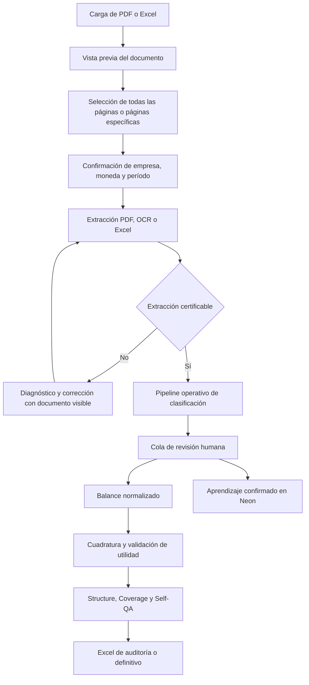

# Estado actual del proyecto de homologación de balances

## Identificación del documento

| Campo | Valor verificado |
|---|---|
| Fecha del levantamiento | 27 de agosto de 2026 |
| Repositorio | `homologacion-balances` |
| Rama candidata documentada | `codex/mejoras-pendientes-20260826` |
| Commit candidato | `84de74b6d8849e24a16a05415bf4f80f0d6f11d4` |
| Rama configurada en Render | `codex/release-operativa-neon` |
| Base de la rama candidata | `origin/codex/release-operativa-neon` |
| Diferencia respecto de la base | 5 commits por delante, 0 por detrás |
| Persistencia operativa | PostgreSQL en Neon, con fallback local controlado |
| Interfaz operativa | Streamlit en `app_validacion.py` |

Este documento describe el estado verificable del código candidato. El `README.md` existente conserva información histórica y no debe usarse como inventario funcional actual. Por ejemplo, todavía menciona 52 categorías, 710 cuentas y componentes de persistencia que ya no representan la implementación operativa.

## 1. Resumen ejecutivo

El proyecto recibe balances chilenos en PDF o Excel, extrae cuentas y montos, certifica la consistencia del documento, clasifica las cuentas contra un catálogo homologado, solicita revisión humana cuando existe ambigüedad y genera un balance normalizado con controles de cuadratura y un archivo Excel para integración.

La rama candidata no está limitada a balances auditados. Conserva el flujo general para balances tributarios de ocho columnas, balances clasificados, documentos comparativos de dos períodos, PDF con texto, PDF procesados por OCR y planillas Excel. Las mejoras recientes para balances auditados amplían la selección de páginas, la detección de períodos, la separación entre notas y montos, la continuidad de secciones entre páginas y la extracción de estados financieros clasificados.

El núcleo operativo actual es:

1. `app_validacion.py` como interfaz y coordinador de la sesión.
2. `parser_universal.py` para PDF, OCR y Excel.
3. `pipeline/homologation_pipeline.py` para clasificación.
4. `persistence/neon_store.py` para catálogo, diccionario y aprendizaje.
5. `account_qualification.py` para separar cuentas, controles, totales y texto no contable.
6. `report_presentation.py` y `reporting_integrity.py` para presentación y validación del entregable.

Existen módulos avanzados de inteligencia documental, decisión, cobertura, estructura y Self-QA. No todos coordinan el flujo principal. Structure, Coverage y Self-QA se consumen como controles auxiliares posteriores. Otros componentes permanecen detrás de banderas o como arquitectura paralela y no deben presentarse como capacidades productivas plenamente integradas.

## 2. Objetivo funcional

El resultado esperado es transformar un documento contable heterogéneo en una salida rígida, trazable y utilizable por una empresa financiera:

- identificar empresa, período, moneda y alcance documental;
- extraer cada cuenta y sus importes sin confundir notas, encabezados, subtotales o firmas;
- conservar el origen contable de cada monto;
- clasificar cada cuenta en el catálogo estándar;
- mostrar al analista las dudas, causas y alternativas compatibles;
- aprender únicamente de decisiones humanas explícitas;
- validar activo contra pasivo más patrimonio;
- validar la utilidad del ejercicio contra el estado de resultados;
- emitir un Excel auditable, incluyendo el detalle completo de cuentas desde la fila 26 de la hoja `Resumen`.

## 3. Alcance documental implementado

### 3.1 Entradas

- PDF con capa de texto.
- PDF escaneado que requiere OCR.
- Excel en formatos `.xlsx` y `.xls` admitidos por la interfaz.
- Uno o varios archivos en una misma sesión.
- Documento completo o páginas seleccionadas por el analista.
- Balances de un período y documentos comparativos de hasta dos períodos.
- Valores en pesos, miles, millones, USD u otra unidad informada por el analista.

### 3.2 Familias de documentos cubiertas

- balance tributario de ocho columnas;
- balance tributario con variaciones de encabezados y geometría;
- balance clasificado con secciones de activo, pasivo, patrimonio y resultados;
- estados financieros auditados con notas y dos años comparativos;
- tablas paralelas o dispuestas lado a lado;
- estructuras verticales IFRS;
- Excel con encabezados y columnas variables.

### 3.3 Límites actuales

- La selección de páginas sigue dependiendo de una decisión humana en documentos extensos.
- La detección de estados y años utiliza heurísticas, no una comprensión documental garantizada para cualquier formato futuro.
- El OCR se ejecuta de forma síncrona y puede ser lento en documentos grandes o de mala calidad.
- Los documentos reales privados sólo se prueban si se configura `BALANCE_REAL_TEST_DIR`.
- El repositorio no contiene todavía una matriz pública suficientemente amplia de informes auditados completos.

## 4. Flujo operativo de la aplicación



### 4.1 Vista y alcance antes del análisis

La aplicación muestra el documento antes de extraer y permite:

- recorrer todas sus páginas;
- aplicar zoom y rotación;
- analizar el documento completo;
- seleccionar páginas concretas;
- cambiar posteriormente el alcance seleccionado.

Esta selección es crítica en informes auditados que contienen notas, anexos y más de una presentación de los mismos estados. Procesar indiscriminadamente todo el archivo puede duplicar cuentas o mezclar estados y notas.

### 4.2 Confirmación de datos de la empresa

La etapa de confirmación solicita o permite corregir:

- RUT;
- razón social;
- giro;
- moneda o unidad, con opciones `$`, `M`, `MM`, `USD` y otra editable;
- mes de cierre;
- año;
- número de meses del período, de 1 a 12;
- período comparativo cuando el documento contiene dos años.

El documento original permanece disponible en esta etapa.

### 4.3 Certificación de la extracción

Antes de clasificar, el sistema distingue:

- cuentas de detalle;
- subtotales y totales usados como controles;
- utilidad o pérdida impresa;
- pies de página, firmas y texto legal;
- filas inconsistentes;
- cuentas posiblemente omitidas;
- diferencias entre la suma de cuentas y los controles impresos.

Los subtotales y totales reconocidos no se suman como cuentas. Se conservan como controles de contraste. El analista no debería excluir manualmente un control que el sistema ya reconoció.

Cuando la extracción no puede certificarse, se muestra una tabla editable con:

- separadores de miles para facilitar la lectura;
- causa concreta de la inconsistencia;
- valor leído y corrección contablemente posible;
- opción de excluir texto no contable;
- opción de ingresar manualmente una cuenta omitida;
- documento original en la mitad inferior de la página.

## 5. Parser universal

`parser_universal.py` concentra la extracción operativa.

### 5.1 Capacidades verificadas en código

- detección de años y monedas mediante `detectar_años_y_monedas`;
- separación de columna de nota y columnas monetarias comparativas;
- agrupación geométrica de palabras con tolerancia vertical de 2,5 píxeles;
- división de tablas lado a lado;
- asociación vertical entre glosas e importes;
- continuidad de secciones entre páginas seleccionadas;
- detección de activo, pasivo, patrimonio y estado de resultados;
- lectura de ocho columnas y variantes comparativas;
- números negativos representados con paréntesis contables;
- guiones o rayas usados como cero;
- limpieza de signos y separadores de miles;
- recuperación de filas fragmentadas por OCR;
- filtrado de número de nota para que no sea tratado como monto;
- conservación del período actual y anterior;
- generación de advertencias y nivel de confianza.

### 5.2 OCR

El contenedor instala Poppler y Tesseract en español. La configuración actual usa:

- render base de 200 DPI;
- límite aproximado de 3,5 millones de píxeles por imagen;
- reintento reducido cuando la primera lectura falla;
- timeout principal de 120 segundos por página;
- timeout de reintento de 90 segundos;
- rotación y recuperación por página;
- omisión controlada de una página cuando Tesseract excede el tiempo, con advertencia al analista.

El timeout evita que la aplicación termine con una excepción no controlada, pero el proceso sigue siendo síncrono. El siguiente salto de rendimiento requiere mover OCR a trabajos en segundo plano, guardar resultados por página y reutilizar páginas ya procesadas.

## 6. Calificación de filas y controles impresos

`account_qualification.py` evita que el pipeline trate como cuentas:

- sumas y sumas iguales;
- totales y totales generales;
- subtotales reconocidos;
- utilidad o pérdida de cierre cuando actúa como control;
- encabezados repetidos;
- firmas y bloques legales;
- filas sin valor contable;
- cuentas con monto cero que no requieren revisión.

Esta capa es determinística. Su finalidad es impedir doble conteo y reducir trabajo manual, no clasificar semánticamente una cuenta real.

## 7. Pipeline operativo de clasificación

La clasificación se ejecuta en `pipeline/homologation_pipeline.py`. El orden general es:

1. coincidencia por código original confiable;
2. coincidencia exacta en el diccionario;
3. coincidencia aproximada con el diccionario;
4. reglas regex auditadas;
5. reglas contextuales;
6. fallback por origen contable;
7. revisión humana cuando la evidencia es insuficiente o contradictoria.

El pipeline puede cargar catálogo y diccionario desde Neon. Si Neon no está disponible, utiliza los JSON versionados como respaldo. En el commit candidato, el catálogo local contiene 65 códigos y el diccionario local 916 entradas. La instancia observada en ejecución reportó 67 códigos y 1.122 cuentas en Neon, por lo que la base remota contiene conocimiento adicional.

### 7.1 Origen y naturaleza efectiva

Cada cuenta conserva:

- columna de origen extraída;
- monto con signo;
- naturaleza efectiva;
- código sugerido;
- método de clasificación;
- confianza;
- estado de revisión.

Un monto negativo se interpreta como contra-cuenta. La naturaleza efectiva puede ser distinta de la columna física del documento. Las clasificaciones incompatibles se ocultan por defecto, pero existen excepciones contables explícitas.

### 7.2 Reglas contables especiales

- Depreciación acumulada: código definitivo `ANC.01.01`. Puede originarse como activo negativo o pasivo positivo y debe restar al activo fijo.
- Pérdidas acumuladas: permanecen en patrimonio aunque aparezcan en la columna activo o con signo contrario.
- Ganancias acumuladas negativas: se ofrecen categorías patrimoniales, no categorías de activo corriente.
- Reservas: se consideran patrimoniales con signo positivo o negativo.
- Cuentas corrientes de socios en activo: requieren consulta humana o tratamiento patrimonial contrario según el caso.
- Pasivo físico: puede ofrecer pasivo corriente, pasivo no corriente y patrimonio cuando el contexto lo justifica.
- Cuentas de valor cero: no deben alimentar la cola de revisión.

## 8. Cola de revisión humana

La cola muestra por cuenta:

- origen extraído y naturaleza efectiva;
- monto del período elegido;
- monto del período anterior, si existe;
- decisión actual y método;
- hasta tres alternativas compatibles;
- confianza de cada alternativa;
- razón de la coincidencia;
- cuentas semejantes confirmadas en Neon;
- advertencia cuando los mejores candidatos son contradictorios;
- búsqueda ampliada de clasificaciones;
- edición de nombre o cuenta;
- aplicación individual o por lote;
- alcance sólo para el caso o aprendizaje futuro;
- recuperación de una cuenta excluida;
- modificación de una decisión previamente confirmada sin recargar el documento.

Las validaciones individual y por lote aplican las mismas reglas de compatibilidad. Una clasificación que contradice la naturaleza efectiva sólo puede admitirse cuando existe una excepción contable documentada.

## 9. Períodos comparativos

Los balances clasificados y auditados pueden contener dos columnas temporales. La implementación actual:

- detecta hasta dos años en las páginas seleccionadas;
- presenta al analista cuál es el período actual y cuál el anterior;
- permite homologar ambos períodos;
- conserva importes separados por período;
- excluye la columna de notas de auditoría;
- exporta columnas rígidas para ambos períodos.

Si los encabezados de años no se detectan con confianza, la interfaz debe exigir confirmación humana. El sistema no debe asignar silenciosamente un número de nota como importe ni omitir la identidad temporal del monto.

## 10. Persistencia y aprendizaje en Neon

La migración versionada `migrations/001_neon_knowledge.sql` crea:

- `catalogo_maestro`;
- `diccionario_homologacion`;
- `log_validaciones`;
- `historial_diccionario`.

El aprendizaje ocurre cuando el analista confirma explícitamente una decisión con alcance futuro. Se registra:

- cuenta original y normalizada;
- código sugerido y código validado;
- método y confianza de la sugerencia;
- si fue una corrección;
- archivo de origen;
- validador y fecha;
- historial de cambios;
- frecuencia de uso.

La interfaz no escribe directamente los JSON de conocimiento. Los JSON quedan como semilla y fallback versionado.

### 10.1 Lo que Neon todavía no resuelve

No existe una migración operativa para persistir de forma completa:

- documentos cargados;
- ejecuciones de extracción;
- alcance de páginas por documento;
- resultados intermedios;
- correcciones de importes;
- reportes emitidos;
- organizaciones o tenants;
- usuarios, roles o sesiones de analista.

El nombre del analista permanece vacío o usa un valor genérico hasta implementar credenciales.

## 11. Balance normalizado y controles posteriores

La vista de balance normalizado presenta:

- todas las categorías del catálogo, incluso las que quedan en cero;
- activo corriente y no corriente;
- pasivo corriente y no corriente;
- patrimonio;
- estado de resultados ordenado;
- total de activos;
- total de pasivos;
- total de patrimonio;
- pasivo más patrimonio;
- diferencia de cuadratura;
- cobertura monetaria y de cuentas;
- utilidad o pérdida del período;
- comparación entre utilidad contable y resultado homologado;
- causas probables del descuadre;
- acceso para volver a la clasificación humana.

La cuadratura aritmética no demuestra que las clasificaciones sean correctas. `reporting_integrity.py` agrega controles independientes para impedir que una clasificación errónea produzca un entregable aparentemente válido sólo porque activo y pasivo más patrimonio coinciden.

## 12. Structure, Coverage y Self-QA

`pipeline/operational_quality.py` consume una copia del resultado ya clasificado.

- Structure identifica formato de códigos, disposición de columnas y secciones.
- Coverage mide cobertura monetaria, estructural, semántica y documental.
- Self-QA recomienda aprobación o revisión según los hallazgos.

Estos motores no reciben permiso para modificar cuentas o importes. Actualmente funcionan en `shadow mode` salvo que se active explícitamente el control de exportación. La variable `QUALITY_CONTROL_ENFORCE_EXPORT` está configurada en `false` en `render.yaml`.

Cuando se active enforcement, estos controles podrán bloquear la exportación o pedir revisión, pero no reclasificar automáticamente.

## 13. Informe Excel

El exportador genera, según el flujo, las hojas:

- `Resumen`;
- `Estado de Resultados`;
- `Balance Normalizado`;
- `Control de emisión`;
- `Cuentas a corregir`;
- `Decisiones de esta sesión`.

### 13.1 Contrato rígido de integración

La hoja `Resumen` reserva la fila 26 para el encabezado del detalle completo. Desde esa fila se entrega una tabla llamada `CuentasClasificadas` con:

- código homologado;
- nombre homologado;
- código original;
- nombre original;
- valor extraído;
- valor homologado;
- columnas separadas por período cuando existen dos años.

La tabla no contiene celdas combinadas ni subtotales intercalados. Está diseñada para ser consumida por sistemas de empresas financieras.

El informe también registra:

- empresa y RUT;
- período;
- moneda o unidad;
- fecha de proceso;
- documento fuente;
- páginas analizadas;
- estado definitivo o borrador;
- motivos de revisión;
- nombre del analista en blanco hasta definir autenticación.

## 14. Arquitectura por estado de integración

### 14.1 Operativo y conectado al flujo principal

| Componente | Responsabilidad |
|---|---|
| `app_validacion.py` | Interfaz, estado de sesión y flujo principal |
| `parser_universal.py` | Extracción PDF, OCR y Excel |
| `document_scope.py` | Selección y render de páginas |
| `extractor_metadata.py` | Metadatos de empresa y período |
| `account_qualification.py` | Cuentas versus controles y ruido |
| `pipeline/homologation_pipeline.py` | Clasificación operativa |
| `persistence/neon_store.py` | Catálogo, diccionario, historial y validaciones |
| `reporting_integrity.py` | Coherencia del entregable |
| `report_presentation.py` | Presentación y contrato Excel |
| `validation/` | Reglas de validación de sesión y resultado |

### 14.2 Auxiliar o en shadow mode

| Componente | Estado |
|---|---|
| `structure_engine/` | Observa estructura, no modifica el resultado |
| `coverage_engine/` | Calcula cobertura posterior |
| `self_qa_engine/` | Recomienda revisión o aprobación |
| `document_context/` | Contexto para motores auxiliares |
| `shadow/` | Comparaciones sin impacto productivo |

### 14.3 Parcial, experimental o detrás de banderas

| Componente | Observación |
|---|---|
| `decision_engine/` | Motor elaborado disponible, desactivado por defecto |
| `semantic/` | Matcher semántico desactivado por defecto |
| `orchestrator/pipeline_v2.py` | No es el coordinador operativo |
| `document_intelligence/` | Capacidades parciales, no equivalen al flujo principal completo |
| `adapters/` | Adaptadores de la arquitectura paralela |
| `src/api/` | API no utilizada por la aplicación Streamlit desplegada |
| CMCC | Disponible con banderas, producción desactivada |

No se recomienda sustituir el pipeline operativo por `HomologationPipelineV2`. Las capacidades útiles deben integrarse una por una, con pruebas y primero en shadow mode.

## 15. Banderas relevantes

Valores predeterminados observados en `pipeline/features.py`:

| Bandera | Predeterminado |
|---|---:|
| CMCC principal | desactivado |
| CMCC shadow | activado, condicionado al interruptor principal |
| CMCC producción | desactivado |
| filtro de tipo CMCC | desactivado |
| regex fallback | activado |
| matcher semántico | desactivado |
| decision engine | desactivado |

La aplicación implementa además validaciones propias de origen, naturaleza efectiva y compatibilidad. Por ello, una bandera CMCC desactivada no significa que la UI carezca de filtros contables.

## 16. Despliegue

Render construye un contenedor Python 3.12 con:

- Poetry;
- Poppler;
- Tesseract y el idioma español;
- Streamlit en el puerto asignado por Render;
- health check `/_stcore/health`;
- `DATABASE_URL` como secreto;
- despliegue automático desactivado.

`render.yaml` todavía apunta a `codex/release-operativa-neon`. Sin embargo, la instancia observada mostró el commit candidato `84de74b6` con la etiqueta de rama `codex/release-operativa-neon`. Esto indica una discrepancia de procedencia visible: el hash desplegado es el dato confiable, mientras `APP_RELEASE_BRANCH` es una etiqueta configurada manualmente.

## 17. Pruebas y evidencia del corte

### 17.1 Suite mantenida

La suite ubicada en `tests/` contiene pruebas de:

- revisión manual individual y por lote;
- contra-cuentas y naturaleza efectiva;
- parser universal y resiliencia OCR;
- selección documental;
- balances comparativos y monedas;
- matrices documentales sintéticas;
- controles de extracción;
- clasificación y aprendizaje;
- Neon y preflight;
- Structure, Coverage y Self-QA;
- informes y cuadratura;
- regresiones de documentos reportados.

En la verificación de este corte, `poetry run pytest tests -q` completó 892 pruebas aprobadas, 16 omitidas y 3 advertencias.

### 17.2 Saneamiento del simulador histórico

El archivo raíz `test_orquestador.py` no contenía pruebas ni aserciones: era un simulador manual que importaba `db_repository` y `src.core.orquestador`, componentes que ya no coordinan la aplicación operativa. Su nombre provocaba que pytest lo recogiera y fallara durante la colección.

El simulador fue retirado explícitamente y reemplazado por `scripts/smoke_pipeline.py`, conectado a `pipeline.homologation_pipeline.HomologationPipeline`. No se modificó la configuración de descubrimiento de pytest para ocultar el problema. El nuevo script acepta la ruta de un PDF o Excel y muestra un resumen del procesamiento sin incluir el detalle completo de cuentas.

### 17.3 Fixtures reales versionados

El repositorio incluye cinco fixtures reales o representativos en `tests/fixtures/balances_reales/`:

- Balance General Agrícola 2013;
- Balance 2017 Mar Vivo;
- Balance 2017 Naviera Orca;
- EEFF 2017 Los Maitenes;
- Pre-Balance Inagal 2020.

La matriz privada añade casos como Parque Cultural, London38, Afuminsal y Fundación Arte y Solidaridad cuando existe `BALANCE_REAL_TEST_DIR`. Sin esa variable, esas pruebas se omiten.

## 18. Riesgos pendientes antes de producción

### Prioridad crítica

1. Certificar una matriz representativa de documentos reales con resultados esperados, no sólo que el parser no falle.
2. Verificar en cada documento que se extrajeron todas las cuentas y que cada monto pertenece al año correcto.
3. Corregir la discrepancia entre rama declarada y hash realmente desplegado.
4. Convertir el release gate en un control que impida desplegar un commit distinto del certificado.
5. Definir autenticación, analista responsable y segregación de acceso antes de manejar información contable sensible de terceros.

### Prioridad alta

1. Persistir documentos, ejecuciones, correcciones y reportes en Neon o almacenamiento durable.
2. Ejecutar OCR en segundo plano con progreso, caché por página y reintentos recuperables.
3. Ampliar fixtures auditados de dos períodos y distintas disposiciones.
4. Medir precisión por cuenta, cobertura monetaria, falsos positivos y tiempo de intervención humana.
5. Activar gradualmente Coverage y Self-QA como gate de exportación cuando exista evidencia suficiente.
6. Separar o retirar la arquitectura paralela que no tiene consumidor operativo.

### Prioridad media

1. Actualizar `README.md` y metadatos de Poetry.
2. Fijar la versión de Poetry en el contenedor.
3. Agregar `.dockerignore` para no enviar artefactos innecesarios al build.
4. Ejecutar el contenedor con un usuario no root.
5. Añadir observabilidad de tiempos por página, OCR, clasificación y descarga.

## 19. Criterio propuesto para lanzamiento

La aplicación puede considerarse candidata a un piloto controlado cuando se cumpla todo lo siguiente:

- suite completa, incluida la raíz, sin errores de colección;
- matriz de documentos estándar, ocho columnas, clasificados, OCR, rotados, comparativos y auditados aprobada;
- exactitud de cuentas y montos revisada contra resultados esperados;
- cuadratura e integridad del estado de resultados aprobadas;
- aprendizaje Neon verificado sin duplicados ni contaminación del catálogo;
- exportación bloqueada ante hallazgos críticos;
- commit desplegado igual al commit certificado;
- respaldo y recuperación de Neon probados;
- autenticación y trazabilidad de analista definidas;
- procedimiento de rollback documentado y ensayado.

Con la evidencia actual, la rama candidata es apta para pruebas funcionales intensivas y un piloto con supervisión. No existe evidencia suficiente para afirmar que procesa correctamente cualquier documento ni para autorizar una producción desatendida.

## 20. Operación local

Requisitos:

- Python 3.12;
- Poetry;
- Poppler;
- Tesseract con idioma español;
- `DATABASE_URL` para Neon, si se desea persistencia remota.

Comandos principales:

```bash
poetry install
poetry run streamlit run app_validacion.py
poetry run pytest tests -q
poetry run python scripts/neon_preflight.py
```

La URL y las credenciales de Neon no deben versionarse. Deben configurarse como variables de entorno locales o secretos de Render y GitHub.

## 21. Fuente de verdad del corte

Para evaluar el estado actual se deben consultar, en este orden:

1. commit desplegado mostrado por la interfaz;
2. rama y commit candidatos indicados al inicio de este documento;
3. pruebas ejecutadas sobre ese commit;
4. `render.yaml` y el release gate;
5. migraciones versionadas de Neon;
6. código del pipeline operativo;
7. documentación histórica sólo como contexto.

Una etiqueta de rama, un HTTP 200 o una cuadratura aritmética aislada no certifican por sí solos la calidad contable del resultado.
